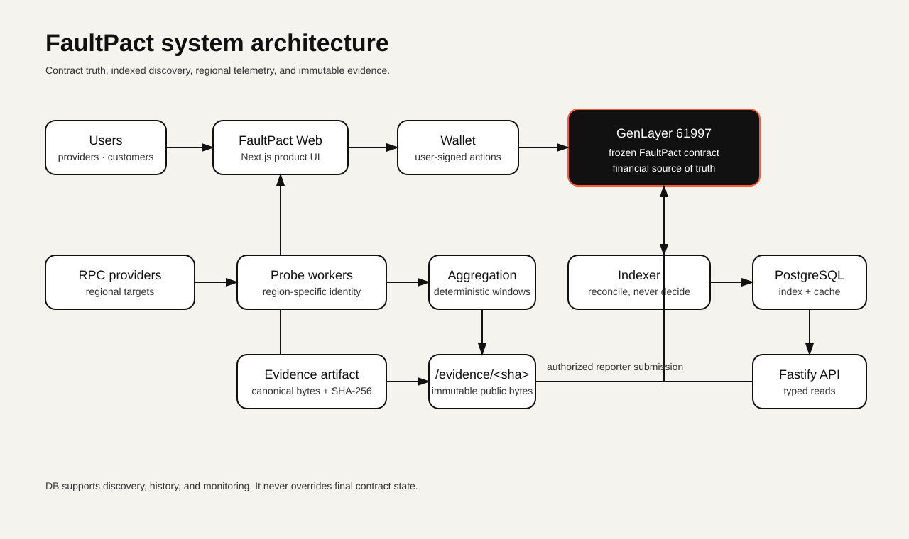

# FaultPact

**Reliability with consequences.**

Providers bond capital behind service SLAs called Pacts. Customers buy Coverage. If a service fails, evidence informs canonical Incident facts; the frozen contract evaluates the Pact and settles eligible Claims from Provider backing.

[Live website](https://faultpact.bydx.fun) · [Documentation](https://faultpact.bydx.fun/docs) · [GitHub](https://github.com/0xbardia/faultpact)

| Deployment | Value |
| --- | --- |
| Network | [GenLayer Studio Development Preview](https://studio-dev.genlayer.com/api) |
| Chain ID | `61997` |
| Contract source | [`contracts/FaultPact.py`](contracts/FaultPact.py) · `0xeb858957e3C426597245f6b59E260f1cC556Bf13` |
| Frozen source SHA-256 | `4913a2af9cac39aac211f8f9fa66e1de8791986db495585c7a1ee9f757e7bb2e` |

## What FaultPact solves

Traditional SLAs can leave measurement, responsibility, and financial consequences disconnected. FaultPact makes the commitment, Provider backing, evidence trail, and settlement rules inspectable in one exchange.

```text
Provider → Service → Pact → Coverage → Incident → Evidence
         → GenLayer canonical facts → contract evaluation → Claim settlement
```

GenLayer resolves Incident facts. The frozen contract applies the Pact terms and determines financial eligibility. The model does not choose payout. PostgreSQL is an index, cache, and monitoring store; the contract is the financial source of truth.

## Architecture



Source: [architecture diagram](docs/architecture/faultpact-system.mmd). User reads flow through Web → API → PostgreSQL. Wallet-signed actions reach the frozen contract. Contract state is indexed back to the API. Probe workers aggregate RPC signals into immutable evidence bytes for authorized reporters.

## Product screenshots

Production captures of the public read surfaces:

| Surface | Screenshot |
| --- | --- |
| Landing, desktop | [View](docs/assets/screenshots/landing-desktop.png) |
| Landing, mobile | [View](docs/assets/screenshots/landing-mobile.png) |
| Explorer | [View](docs/assets/screenshots/explore-desktop.png) |
| Pact detail | [View](docs/assets/screenshots/pact-detail-desktop.png) |
| Incident and evidence | [View](docs/assets/screenshots/incident-evidence-desktop.png) |
| Provider dashboard | [View](docs/assets/screenshots/provider-dashboard-desktop.png) |
| Provider capital profile | [View](docs/assets/screenshots/provider-profile-desktop.png) |
| Customer dashboard | [View](docs/assets/screenshots/customer-dashboard-desktop.png) |
| Monitoring | [View](docs/assets/screenshots/monitoring-desktop.png) |
| Documentation | [View](docs/assets/screenshots/docs-desktop.png) |

## Provider and Customer workflows

Anyone can browse Providers, Services, Pacts, Coverages, Incidents, Claims, and monitoring without connecting a wallet. The Coverage purchase screen explains GEN amounts, premium, duration, and capacity before wallet confirmation.

Provider profiles show total, allocated, reserved, and pending capital. Reserved capital backs active Coverage or claims and is not free to withdraw. Provider registration, Service creation, Pact publishing, capital operations, and claim filing are not exposed as write flows in the current web console; the Provider console is read-only. This gap blocks the public v1.0.0 release.

## Monitoring and evidence

Regional workers probe configured RPC targets and aggregate bounded monitoring windows. Probe results are operational signals, not settlement decisions. Incident pages show onchain evidence provenance and which IDs support or are excluded from canonical facts.

Locally stored monitoring artifacts are served as immutable exact bytes at `/evidence/<sha256>`. Onchain evidence may instead reference an external source URI; the index does not fetch that URI, so its bytes and submitted hash are shown as unchecked. SHA-256 verifies byte identity only when the bytes are actually checked; it does not prove the measurement is true or who produced it.

## Signer-backed Evidence Worker

A dedicated reporter wallet can take one canonical immutable artifact through the frozen contract with `attach_incident_report` and `submit_evidence`, wait for both transactions to finalize, and verify the resulting evidence from contract state. The reporter private key is optional: without it the worker stays MONITOR-ONLY and only produces artifacts.

```bash
pnpm evidence:submit --incident-id <open-incident-id> --dry-run   # verify preconditions, sign nothing
pnpm evidence:submit --incident-id <open-incident-id>             # submit and verify from contract state
pnpm test:reporter-live                                           # live Studio Dev certification
```

| Item | Location |
| --- | --- |
| Worker implementation | [`apps/worker/src/reporter-submit.ts`](apps/worker/src/reporter-submit.ts) · [`reporter-runtime.ts`](apps/worker/src/reporter-runtime.ts) · [`reporter-cli.ts`](apps/worker/src/reporter-cli.ts) |
| Signer and transaction lifecycle | [`packages/contract/src/reporter.ts`](packages/contract/src/reporter.ts) · [`transactions.ts`](packages/contract/src/transactions.ts) |
| Evidence argument and read-back rules | [`packages/monitoring/src/reporter.ts`](packages/monitoring/src/reporter.ts) |
| Live integration test | [`tests/certification/reporter-live.test.ts`](tests/certification/reporter-live.test.ts) |
| Deterministic integration test | [`apps/worker/src/reporter-submit.test.ts`](apps/worker/src/reporter-submit.test.ts) |
| Evidence pipeline documentation | [`docs/EVIDENCE_PIPELINE.md`](docs/EVIDENCE_PIPELINE.md) |
| Authorized reporter setup | [`docs/OPERATIONS.md`](docs/OPERATIONS.md#authorized-reporter-setup) |
| Phase 4.4 certification report | [`docs/PHASE_4_4_SIGNER_EVIDENCE_CERTIFICATION.md`](docs/PHASE_4_4_SIGNER_EVIDENCE_CERTIFICATION.md) |
| Phase 4.4.1 live proof closure | [`docs/PHASE_4_4_1_LIVE_PROOF_CLOSURE.md`](docs/PHASE_4_4_1_LIVE_PROOF_CLOSURE.md) |

The worker fails closed: it signs only for chain `61997`, the frozen contract address, and the frozen source digest; it re-checks the contract's `is_authorized_reporter` before every submission; it hashes the exact public artifact bytes and refuses any mismatch; it treats an undecided transaction as `NOT VERIFIED` rather than success; and it reconciles interrupted attempts instead of duplicating evidence.

**Live proof (Phase 4.4.1).** An authorized reporter
(`0x99FF79513004dB21546a0c1b419f48ae30760580`) submitted one canonical artifact
to incident `9` through both `attach_incident_report` and `submit_evidence`.
Both transactions finalized and the resulting evidence records `16` and `17` were
read back from contract state with a matching URI, SHA-256, submitter and
`AUTHORITATIVE` provenance. The indexer, API and frontend show both records.
See [the closure report](docs/PHASE_4_4_1_LIVE_PROOF_CLOSURE.md).

## Security model

- The frozen contract determines financial state and settlement.
- The API exposes bounded, paginated reads; internal monitoring-target changes require admin authentication.
- Monitoring target URLs are checked against SSRF, DNS rebinding, and redirect risks.
- User financial actions are signed in the browser wallet; the backend does not custody user keys.
- Reporter keys are optional, environment-only, and isolated from database records and logs.
- Evidence artifacts are content addressed and are not reserialized when served.

See the [security model](docs/PHASE_0_1_HARDENING.md), [contract audit](docs/CODEX_CONTRACT_AUDIT.md), and [operations guide](docs/OPERATIONS.md).

## Local development

Requirements: Node.js 22, pnpm, and PostgreSQL.

```bash
cp .env.example .env
# Set DATABASE_URL and the local GenLayer deployment settings in .env.
corepack pnpm install --frozen-lockfile
corepack pnpm db:generate
corepack pnpm db:migrate
corepack pnpm lint
corepack pnpm typecheck
corepack pnpm test
corepack pnpm build
```

The browser uses `/api/v1` by default. Do not run database migrations against a shared environment without checking the target `DATABASE_URL` first.

## Environment variables

See [.env.example](.env.example) for the supported variable names. Values are environment-specific and must not be committed. `REPORTER_PRIVATE_KEY` is optional and stays on the worker host.

## Tests

The repository contains Vitest unit tests, PostgreSQL and live-contract integration checks, web Playwright coverage, and Python contract regressions. Integration checks depend on a database URL and Studio RPC quota. See the [latest final product audit](docs/FINAL_PRODUCT_AUDIT.md) for the results from this pass.

## Deployment and documentation

- [System architecture](docs/ARCHITECTURE.md)
- [Backend](docs/BACKEND.md)
- [Indexer](docs/INDEXER.md)
- [Monitoring](docs/MONITORING.md)
- [Evidence pipeline](docs/EVIDENCE_PIPELINE.md)
- [Frontend](docs/FRONTEND.md)
- [Production deployment](docs/PRODUCTION_DEPLOYMENT.md)
- [Operations](docs/OPERATIONS.md)
- [Phase 1–2 certification](docs/PHASE_1_2_CERTIFICATION.md)
- [Phase 3 certification](docs/PHASE_3_CERTIFICATION.md)
- [Phase 4 certification](docs/PHASE_4_FINAL_SYSTEM_CERTIFICATION.md)
- [Phase 4.4 signer evidence certification](docs/PHASE_4_4_SIGNER_EVIDENCE_CERTIFICATION.md)
- [Phase 4.4.1 live proof closure](docs/PHASE_4_4_1_LIVE_PROOF_CLOSURE.md)

## Known limitations

F-04 is a bounded resource and liveness limitation: the pinned contract SDK reads remote evidence bodies before applying its content checks, so a bad source can delay ordinary Incident resolution; the timeout path remains available. F-06 is an accepted GenLayer runtime limitation around external native GEN transfer failure semantics. FaultPact distinguishes internal claimable credit from an external transfer and does not claim that funds were received before the contract/runtime outcome is known.

## Release status

**v1.0.0 is not released.** The final pass improved the user-facing product and backend behavior, but provider write workflows and browser-wallet confirmation remain unverified, and the live Studio RPC returned HTTP 429 during integration validation. Release tagging is blocked pending those gates. See [the UX audit](docs/FINAL_UX_AUDIT.md) and [the final product audit](docs/FINAL_PRODUCT_AUDIT.md).

No license is declared in this repository.
